# YOLOsandbox: Let AI Code in YOLO Mode, Safely

Give your AI assistants full coding freedom in a secure Docker container.
They can install anything, run anything, break anything - your system stays safe.


## 🚀 Quick Start → [QUICKSTART.md](docs/QUICKSTART.md)

**5 minutes from zero to AI coding safely.**
Run this in the directory that you want YOLOsandbox to have access to. 

If this is a project directory, best practice dictates that you have it under version control. Docker must be previously installed (see [Prerequisites](#-prerequisites)).

```bash
curl -sSL https://raw.githubusercontent.com/YOLOsandbox/simple-sandbox/main/init.sh | bash
```

## 🎯 What Problems Does This Solve?

- **"I'm scared AI will break something"** → AI can only work in the sandbox
- **"AI needs sudo to install packages"** → Give it sudo! It's isolated
- **"What if AI deletes important files?"** → Your files are protected
- **"AI-generated code might be malicious"** → It runs in complete isolation

## 📋 Prerequisites

- **Docker** - Creates the isolation ([5 minute install](docs/QUICKSTART.md#-step-1-install-docker-2-5-minutes))
- **Your favorite AI** - Claude, Gemini, ChatGPT, Cursor, etc.
- **A project idea** - Something for AI to help you build


## 🎓 Documentation

### For Different Learning Styles

| Document | Purpose | Time |
|----------|---------|------|
| **[🚀 QUICKSTART](docs/QUICKSTART.md)** | Get up and running fast | 5 min |
| **[📖 EXAMPLES](docs/EXAMPLES.md)** | Learn by doing with real examples | 10-30 min |
| **[🔒 UNDERSTANDING_SAFETY](docs/UNDERSTANDING_SAFETY.md)** | Understand how protection works | 15 min |
| **[🔧 TECHNICAL_REFERENCE](docs/TECHNICAL_REFERENCE.md)** | Deep dive into features & configuration | Varies |
| **[❓ TROUBLESHOOTING](docs/TROUBLESHOOTING.md)** | Solve common problems | As needed |

### Choose Your Path

```mermaid
graph TD
    Start[New to YOLOsandbox?]
    Start -->|Just want it working| Quick[🚀 QUICKSTART]
    Start -->|Learn by examples| Examples[📖 EXAMPLES]
    Start -->|Understand security| Safety[🔒 UNDERSTANDING_SAFETY]
    Start -->|Need all details| Tech[🔧 TECHNICAL_REFERENCE]

    Quick --> Examples
    Examples --> Safety
    Safety --> Tech

    style Start fill:#FFE4B5
    style Quick fill:#90EE90
```



## 🎯 Who Is This For?

### ✅ Perfect For You If:
- You want to use AI coding assistants without worry
- You're learning to code with AI help
- You need to test AI-generated code safely
- You want to give AI full freedom to experiment
- You're evaluating AI tools for your team

### ❌ Not For You If:
- You need production deployment (use real container orchestration)
- You want to learn Docker itself (this hides the complexity)
- You need multi-container applications (use docker-compose directly)

## 🌟 Key Features

### What AI Can Do Safely

```mermaid
graph TB
    subgraph "✅ AI CAN"
        Can1[📦 Install any package]
        Can2[🔧 Use sudo freely]
        Can3[🏃 Run any code]
        Can4[🌐 Access internet]
        Can5[💾 Persist your work]
    end

    subgraph "❌ AI CANNOT"
        Cannot1[🚫 Touch your files]
        Cannot2[🚫 Break your system]
        Cannot3[🚫 Access passwords]
        Cannot4[🚫 See other projects]
        Cannot5[🚫 Escape the sandbox]
    end

    style Can1 fill:#90EE90
    style Can2 fill:#90EE90
    style Can3 fill:#90EE90
    style Can4 fill:#90EE90
    style Can5 fill:#90EE90
    style Cannot1 fill:#FFB6C1
    style Cannot2 fill:#FFB6C1
    style Cannot3 fill:#FFB6C1
    style Cannot4 fill:#FFB6C1
    style Cannot5 fill:#FFB6C1
```  



### Pre-Installed Development Stack

| Category | What's Included | Purpose |
|----------|----------------|----------|
| **AI Tools** | Claude (`claude`), Gemini CLI (`gemini`) | Ready-to-use AI assistants |
| **Languages** | Python 3.11 (via UV), Node.js v22 (via nvm) | Modern development |
| **Package Managers** | UV (Python), npm (Node), apt (System) | Install anything |
| **Developer Tools** | git, curl, wget, nano | Essential utilities |
| **System** | Ubuntu 24.04 LTS, sudo access | Stable foundation |

### Security Architecture

```mermaid
graph TB
    subgraph "Protection Layers"
        L1[🐳 Docker Isolation]
        L2[🔒 Namespace Separation]
        L3[🛡️ Capability Restrictions]
        L4[📊 Resource Limits]
        L5[👤 Non-root User]
    end

    L1 --> L2 --> L3 --> L4 --> L5
    L5 --> Safe[✅ AI Works Safely]

    style L1 fill:#E6F3FF
    style Safe fill:#90EE90
```



Learn more: [🔒 Understanding Safety](docs/UNDERSTANDING_SAFETY.md)

## 💡 How It Works

YOLOsandbox uses Docker containers to create a completely isolated environment:

1. **Docker creates a container** - Like a virtual computer inside your computer
2. **Your project folder is mounted** - AI can see and edit your code
3. **Everything else is isolated** - AI can't access anything else
4. **Multiple security layers** - Even if one fails, others protect you

For a deeper understanding: [🔒 Understanding Safety](docs/UNDERSTANDING_SAFETY.md)

## 🚀 Getting Started

### Fastest Path (If Docker is installed)

```bash
# One command setup
curl -sSL https://raw.githubusercontent.com/YOLOsandbox/simple-sandbox/main/init.sh | bash

# Then in VS Code: Click "Reopen in Container"
# Or via terminal: docker-compose -f docker/docker-compose.yml exec simple-sandbox bash
```

### Need Help?

- **First time?** → [🚀 QUICKSTART](docs/QUICKSTART.md) (includes Docker setup)
- **Want examples?** → [📖 EXAMPLES](docs/EXAMPLES.md)
- **Having issues?** → [❓ TROUBLESHOOTING](docs/TROUBLESHOOTING.md)
- **Community** → [GitHub Discussions](https://github.com/YOLOsandbox/simple-sandbox/discussions)

## 🎯 Real-World Use Cases

### What People Build with YOLOsandbox

- **🎓 Learning**: Students learning programming with AI guidance
- **🧪 Experimentation**: Testing AI-generated code safely
- **🚀 Rapid Prototyping**: Building MVPs with AI assistance
- **📝 Code Review**: Having AI analyze and improve existing code
- **🔧 Automation**: Creating scripts and tools with AI
- **📚 Documentation**: AI writing tests and documentation

See real examples: [📖 EXAMPLES](docs/EXAMPLES.md)

## 📊 Technical Specifications

<details>
<summary>Click for technical details</summary>

### Container Specifications
- **Base**: Ubuntu 24.04 LTS
- **Size**: ~1GB (426MB AI tools, 243MB Node.js, 140MB system)
- **Resources**: 4 CPUs, 8GB RAM, 1000 process limit
- **Security**: Namespace isolation, capability drops, no privileged access

### File System
- **Workspace**: Your project mounted at `/workspace` (read/write)
- **Config**: Docker and .devcontainer folders (read-only)
- **Persistence**: AI data in `claude-data/` (git-ignored)

### For more details: [🔧 TECHNICAL_REFERENCE](docs/TECHNICAL_REFERENCE.md)

</details>

## 🤝 Contributing

We welcome contributions! YOLOsandbox is open source and community-driven.

- **Report bugs**: [GitHub Issues](https://github.com/YOLOsandbox/simple-sandbox/issues)
- **Ask questions**: [GitHub Discussions](https://github.com/YOLOsandbox/simple-sandbox/discussions)
- **Contribute code**: [Contributing Guide](CONTRIBUTING.md)

## 📄 License

This project is licensed under the [MIT License](LICENSE).

**What this means:**
- ✅ Free for personal and commercial use
- ✅ Modify and distribute as needed
- ✅ Use in proprietary software
- ✅ No warranty provided
- Copyright 2025 YOLOsandbox (https://yolosandbox.com)

---

<div align="center">

**Ready to let AI code safely?**

[🚀 Get Started](docs/QUICKSTART.md) • [📖 See Examples](docs/EXAMPLES.md) • [🔒 Learn More](docs/UNDERSTANDING_SAFETY.md)

</div>