# 🚀 Safe AI Coding in 5 Minutes

Let the AI assistant write code without breaking anything. This guide will get you from zero to AI-assisted coding in under 5 minutes.

## What You're Building

You're creating a safe backyard sandbox where the AI assistant can play and build code without entering your house. Think of it like giving a child their own sandbox in the backyard - they can build anything they want in the sand while your house stays clean and secure.

```mermaid
graph LR
    You[👤 You] --> Property[🏡 Your Property]
    Property --> House[🏠 Your House - Protected]
    Property --> Sandbox[🪣 Backyard Sandbox]
    Sandbox --> Child[👶 Child Plays Here]
    Child -.cannot enter.- House

    style Sandbox fill:#E6F3FF
    style House fill:#90EE90
```



## Before You Start (One-Time Setup)

You need Docker to build the backyard sandbox. Docker is free software that creates the fence and boundaries - it's what keeps AI playing safely in the backyard instead of entering your house.


### 📦 Step 1: Install Docker (2-5 minutes)

<details>
<summary>🍎 <b>Mac Users</b> (click to expand)</summary>

1. **Download Docker Desktop**: https://www.docker.com/products/docker-desktop/
2. **Install**: Open the downloaded file and drag Docker to Applications
3. **Start Docker**:
   - Open Docker from Applications
   - Wait for the whale icon to appear in your menu bar
   - The whale should be steady (not animated) when ready
4. **Verify**: Open Terminal and run:
   ```bash
   docker --version
   ```
   You should see: `Docker version 24.0` or higher

✅ **Success!** Docker is ready when you see the whale icon in your menu bar.

</details>

<details>
<summary>🪟 <b>Windows Users</b> (click to expand)</summary>

1. **System Requirements**: Windows 10/11 (64-bit) with WSL 2 enabled
2. **Download Docker Desktop**: https://www.docker.com/products/docker-desktop/
3. **Install**:
   - Run the installer (Docker Desktop Installer.exe)
   - Follow the installation wizard
   - **Important**: Restart your computer when prompted
4. **Start Docker**:
   - Open Docker Desktop from Start Menu
   - Wait for "Docker Desktop is running" in the system tray
5. **Verify**: Open Command Prompt or PowerShell and run:
   ```bash
   docker --version
   ```
   You should see: `Docker version 24.0` or higher

✅ **Success!** Docker is ready when you see "Docker Desktop is running" in the system tray.

**Troubleshooting Windows:**
- If you see "WSL 2 installation is incomplete", follow the link in the error message
- If Docker doesn't start, right-click the Docker Desktop icon and select "Run as Administrator"

</details>

<details>
<summary>🐧 <b>Linux Users</b> (click to expand)</summary>

```bash
# For Ubuntu/Debian:
curl -fsSL https://get.docker.com | sudo sh
sudo usermod -aG docker $USER

# For other distributions, see: https://docs.docker.com/engine/install/

# IMPORTANT: Log out and log back in for group changes to take effect

# Verify installation:
docker --version
```

You should see: `Docker version 24.0` or higher

✅ **Success!** Docker is ready when the version command works without sudo.

</details>

### ✅ Verify Docker is Running

Before continuing, make sure Docker is running:

```bash
docker ps
```

**Expected output**: Either an empty table or a list of containers
**If you see an error**: Start Docker Desktop (Mac/Windows) or the Docker service (Linux)

## Step 2: Install YOLOsandbox (30 seconds)

Now that Docker is running, installing YOLOsandbox is just one command:

```bash
# Run this in your project directory (or create a new one)
curl -sSL https://raw.githubusercontent.com/YOLOsandbox/simple-sandbox/main/init.sh | bash
```

**What you'll see:**
```
✅ Downloaded sandbox template
✅ Created project structure
✅ Built development environment
✅ Container is running
🎉 SUCCESS! Your AI coding assistant is now safe to use.
```

## Step 3: Start Using AI Safely

### Option A: With VS Code (Recommended)

1. Open your project folder in VS Code
2. You'll see a notification: "Folder contains a Dev Container configuration"
3. Click **"Reopen in Container"**
4. Wait for the container to start (first time takes 1-2 minutes)
5. You're now in the safe sandbox! The terminal at the bottom shows `developer@yolosandbox`

### Option B: Command Line

```bash
# Enter the sandbox
docker-compose -f docker/docker-compose.yml exec simple-sandbox bash

# You'll see the prompt change to:
developer@yolosandbox:/workspace$

# Try a simple command to verify:
python3.11 --version
```

## Your First AI Task

Now let's verify AI can work safely. Try this:

1. Ask your AI assistant: "Create a Python script that prints 'Hello from the sandbox!'"
2. Let AI create and run the file
3. Notice: The file appears in your project, but AI couldn't access anything outside

**Example conversation:**
```
You: Create and run a Python hello world script
AI: I'll create a simple Python script for you...
[AI creates hello.py and runs it]
Output: Hello from the sandbox!
```

## What Just Happened?

```mermaid
graph TB
    subgraph "Your Computer"
        Docker[🐳 Docker Engine]
        YourFiles[📁 Your Personal Files]
        YourSystem[⚙️ System Settings]
    end

    subgraph "Sandbox Container"
        AI[🤖 AI Assistant]
        Workspace[📂 Project Files]
        Tools[🛠️ Dev Tools]
    end

    Docker -->|Creates & Manages| Sandbox
    AI -->|Can Only Access| Workspace
    AI -.-|Cannot Access| YourFiles
    AI -.-|Cannot Access| YourSystem

    style Sandbox fill:#E6F3FF
    style YourFiles fill:#90EE90
    style YourSystem fill:#90EE90
```



Docker created an isolated container where:
- ✅ AI can write code, install packages, run commands
- ✅ Your project files are accessible (mounted at `/workspace`)
- ❌ AI cannot access your personal files
- ❌ AI cannot modify system settings
- ❌ AI cannot break your computer

## Common Questions

<details>
<summary>❓ <b>Is this really safe?</b></summary>

Yes! The sandbox uses multiple layers of protection:
- **Namespace isolation**: Complete separation from your system
- **Capability restrictions**: Cannot perform administrative actions
- **Resource limits**: Cannot use all your CPU/memory
- **Read-only mounts**: Cannot modify Docker or configuration files

Even if AI tries something dangerous, it only affects the sandbox.

</details>

<details>
<summary>❓ <b>What can AI do inside the sandbox?</b></summary>

AI can:
- ✅ Write and modify code in your project
- ✅ Install any programming language or tool
- ✅ Run tests and build processes
- ✅ Access the internet for package downloads
- ✅ Create and delete files in the workspace

AI cannot:
- ❌ Access files outside your project folder
- ❌ See your browser history, passwords, or personal data
- ❌ Modify system settings
- ❌ Install software on your actual computer
- ❌ Access other containers or services

</details>

<details>
<summary>❓ <b>How do I stop/restart the sandbox?</b></summary>

```bash
# Stop the sandbox
docker-compose -f docker/docker-compose.yml down

# Restart the sandbox
docker-compose -f docker/docker-compose.yml up -d

# View sandbox status
docker-compose -f docker/docker-compose.yml ps
```

Your files are always safe and persist between restarts.

</details>

## Next Steps

Now that you have a working sandbox:

🎯 **Learn by doing** → [EXAMPLES.md](EXAMPLES.md) - Try practical AI coding examples
📚 **Understand the technology** → [UNDERSTANDING_SAFETY.md](UNDERSTANDING_SAFETY.md) - Deep dive into how it works
🔧 **Advanced features** → [TECHNICAL_REFERENCE.md](TECHNICAL_REFERENCE.md) - Customize your sandbox
❓ **Having issues?** → [TROUBLESHOOTING.md](TROUBLESHOOTING.md) - Common problems and solutions

## Quick Reference Card

```
┌─────────────── 🎯 QUICK COMMANDS ───────────────┐
│                                                  │
│ Enter sandbox:   docker-compose -f docker/      │
│                  docker-compose.yml exec         │
│                  simple-sandbox bash             │
│                                                  │
│ View status:     docker-compose -f docker/      │
│                  docker-compose.yml ps           │
│                                                  │
│ Stop sandbox:    docker-compose -f docker/      │
│                  docker-compose.yml down         │
│                                                  │
│ Restart:         docker-compose -f docker/      │
│                  docker-compose.yml up -d        │
│                                                  │
└──────────────────────────────────────────────────┘
```

---

🎉 **Congratulations!** You've successfully set up a safe AI coding environment. Your AI assistant can now help you code without any risk to your system.