# 🔒 Understanding YOLOsandbox Safety

This guide explains how YOLOsandbox keeps your computer safe while giving AI complete freedom to code. No technical knowledge required!

## The Sandbox Metaphor

Imagine your property with a house and backyard:

```mermaid
graph TB
    subgraph "Your Property (Your Computer)"
        subgraph "Your House (Protected Area)"
            LivingRoom["🛋️ Living Room - Personal Files"]
            Office["💼 Office - Work Documents"]
            Safe["🔐 Safe - Passwords & Keys"]
        end

        subgraph "Backyard (Container Space)"
            subgraph "Sandbox (YOLOsandbox)"
                Sand["🪣 Sand - Workspace"]
                Toys["🪀 Toys - Dev Tools"]
                Child["👶 Child - AI Assistant"]
            end
        end
    end

    Child -->|Can play with| Sand
    Child -->|Can use| Toys
    Child -.-|Cannot enter| LivingRoom
    Child -.-|Cannot access| Office
    Child -.-|Cannot open| Safe

    style Sand fill:#FFE4B5
    style LivingRoom fill:#90EE90
    style Office fill:#90EE90
    style Safe fill:#90EE90
```



**The child (AI) can:**
- ✅ Build anything in the sandbox
- ✅ Use all the toys provided (development tools)
- ✅ Make any mess in the sand (it's contained)
- ✅ Be completely creative within the sandbox

**The child (AI) cannot:**
- ❌ Leave the sandbox to wander the yard
- ❌ Enter your house through any door or window
- ❌ Access anything stored in your house
- ❌ Affect your property beyond the sandbox

This is exactly how YOLOsandbox works with AI!

## How Docker Creates the Sandbox

Docker is the technology that builds and maintains the sandbox:

```mermaid
graph LR
    subgraph "Without Docker"
        Child1[👶 Child] -->|Direct Access| Computer1[💻 Computer]
        Computer1 --> Danger[⚠️ Can Delete/Modify Anything!]
    end

    subgraph "With Docker + YOLOsandbox"
        Docker[🐳 Docker] -->|Creates| Sandbox[🪣 Sandbox]
        Child2[👶 Child] -->|Works Inside| Sandbox
        Sandbox -.-|Blocked| Computer2[💻 Computer]
        Computer2 --> Safe[✅ Completely Protected]
    end

    style Danger fill:#FFB6C1
    style Safe fill:#90EE90
    style Sandbox fill:#E6F3FF
```



Think of Docker as:
- **The construction crew** that builds the sandbox in your backyard
- **The fence** around the sandbox that keeps everything contained
- **The security camera** that monitors what happens in the sandbox

## Layers of Protection

YOLOsandbox doesn't rely on just one safety mechanism. It uses multiple layers, like security at your property:

```mermaid
graph TD
    subgraph "Property Security Layers"
        Fence["🪵 Property Fence - Docker Isolation"]
        Locks["🔐 House Locks - Namespace Separation"]
        Doors["🚪 Interior Doors - Capability Restrictions"]
        Cameras["📹 Security System - Resource Monitoring"]
        SafeRoom["🗝️ Safe Room - User Permissions"]

        Valuables["💎 Your Valuables - Protected"]
    end

    Fence --> Locks
    Locks --> Doors
    Doors --> Cameras
    Cameras --> SafeRoom
    SafeRoom --> Valuables

    Child["👶 Child in Sandbox"] -.Cannot reach.- Valuables

    style Valuables fill:#90EE90
    style Child fill:#FFB6C1
```



Even if the child somehow got past one layer (they can't), there are multiple other protections.

## What Each Protection Layer Does

### 1. 🪵 Docker Isolation (Property Fence)
- **What it is**: Complete separation from your system
- **Real-world analogy**: Like a tall fence around your backyard - the sandbox is contained
- **What it prevents**: The child leaving the sandbox area to access your house

### 2. 🔐 Namespace Separation (House Locks)
- **What it is**: The child gets their own view of the system
- **Real-world analogy**: Like locked doors - AI can see the house exists but can't get in
- **What it prevents**: The child seeing your real files, processes, or network

### 3. 🚪 Capability Restrictions (Interior Doors)
- **What it is**: The child can't perform administrative actions
- **Real-world analogy**: Like child-proof locks on cabinets - certain areas stay off-limits
- **What it prevents**: The child changing system settings or accessing hardware

### 4. 📹 Resource Limits (Security System)
- **What it is**: The child can only use limited CPU, memory, and processes
- **Real-world analogy**: Like a security system that monitors activity and sets boundaries
- **What it prevents**: The child using all your computer's resources

### 5. 🗝️ User Permissions (Safe Room)
- **What it is**: The child plays as a regular user, not administrator
- **Real-world analogy**: Like a guest who can play in the backyard but can't access the master bedroom
- **What it prevents**: The child making system-wide changes

## Your Files and Data

Understanding what the child can and cannot access:

```mermaid
graph TB
    subgraph "Your Computer's Files"
        Personal["📁 Personal Files: /home/yourname/"]
        System["⚙️ System Files: /etc, /usr, /bin"]
        Project["📂 Your Project: /path/to/project"]
    end

    subgraph "What AI Sees"
        Workspace["📂 /workspace - Your Project Only"]
        Container["📦 Container Files - Temporary"]
    end

    Project -->|Mounted As| Workspace
    Personal -.-|Not Visible| Workspace
    System -.-|Not Visible| Workspace

    Child["👶 Child"] -->|Can Access| Workspace
    Child -->|Can Access| Container

    style Personal fill:#90EE90
    style System fill:#90EE90
    style Project fill:#FFE4B5
```



**Important**: Only your project folder is accessible to the child. Everything else on your computer is invisible and unreachable.

## Common Security Concerns Addressed

### "What if the child tries to delete everything?"

```mermaid
sequenceDiagram
    participant Child as 👶 Child
    participant Sandbox as 🪣 Sandbox
    participant System as 💻 Your System

    Child->>Sandbox: Delete everything command
    Sandbox->>Sandbox: Deletes sandbox files only
    Sandbox-->>Child: Done - sandbox cleared
    System-->>System: Completely unaffected ✅

    Note over System: Your files are safe!
```



Even if the child runs the most destructive commands, they only affect the sandbox.

### "What if the child tries to access my passwords?"

```mermaid
graph LR
    Child["👶 Child"] -->|Tries to read| Passwords["🔐 SSH Keys"]
    Sandbox["🪣 Sandbox"] -->|Returns| NotFound["❌ File not found"]

    Child -->|Tries to read| Browser["🌐 Browser data"]
    Sandbox -->|Returns| NotFound2["❌ File not found"]

    style Passwords fill:#90EE90
    style Browser fill:#90EE90
```



The child literally cannot see files outside your project folder. They don't exist from the child's perspective.

### "What if the child installs malicious software?"

```mermaid
graph TD
    Child["👶 Child"] -->|Installs| Malware["☠️ Malicious Software"]
    Malware -->|Runs In| Sandbox["🪣 Sandbox"]
    Sandbox -.-|Cannot Affect| System["💻 Your System"]

    Stop["🛑 Stop Container"] -->|Destroys| Sandbox
    Stop -->|Malware| Gone["💨 Completely Gone"]

    style System fill:#90EE90
    style Gone fill:#90EE90
```



Any software the child installs:
- Only exists in the sandbox
- Cannot access your real system
- Disappears when you stop the container

## Testing the Safety Yourself

Want to see the protection in action? Try these safe experiments:

### Test 1: File Access
```bash
# Inside the sandbox, try to access your home folder
ls ~/Documents
# Result: "No such file or directory" - the child can't see it!
```

### Test 2: System Changes
```bash
# Try to modify system files
sudo rm /etc/passwd
# Result: Changes only affect the sandbox copy
# Your real system files are untouched
```

### Test 3: Resource Limits
```bash
# Try to use all memory
stress --vm 999 --vm-bytes 1G
# Result: Container enforces limits, your system stays responsive
```

## Real-World Safety Scenarios

### Scenario 1: The Child Downloads and Runs Unknown Code

```mermaid
sequenceDiagram
    participant You
    participant Child as 👶 Child
    participant Sandbox as 🪣 Sandbox
    participant System as 💻 System

    You->>Child: Download and test this GitHub project
    Child->>Sandbox: Downloads unknown code
    Child->>Sandbox: Runs potentially dangerous script
    Sandbox->>Sandbox: Script runs - might be malicious
    Sandbox-->>Child: Results or errors
    Child-->>You: Here's what happened
    System-->>System: Remained safe throughout ✅
```


### Scenario 2: The Child Makes a Mistake

```mermaid
sequenceDiagram
    participant You
    participant Child as 👶 Child
    participant Sandbox as 🪣 Sandbox

    You->>Child: Clean up temporary files
    Child->>Sandbox: Wrong delete command executed
    Sandbox->>Sandbox: Deletes sandbox contents
    You->>You: Restart container
    Sandbox->>Sandbox: Fresh sandbox ready
    Note over Sandbox: Your project files still safe!
```


## Frequently Asked Questions

### Is this really 100% safe?

YOLOsandbox uses the same container technology that runs critical services at Google, Amazon, and Microsoft. The isolation is at the kernel level - it's not just an application saying "please don't touch that," it's the operating system enforcing hard boundaries.

### What about zero-day exploits?

While no software is perfect, breaking out of a properly configured container requires:
1. A kernel vulnerability (very rare)
2. Multiple security features failing simultaneously
3. Bypassing resource limits and permissions

This is why we use defense in depth - multiple independent layers of protection.

### Can I verify the isolation myself?

Absolutely! Try these commands inside the sandbox:
- `mount` - See that only your project is mounted
- `ps aux` - See only sandbox processes
- `ip addr` - See isolated network
- `df -h` - See limited disk view

### What if I need the child to access more folders?

You can mount additional folders when needed, but each mount increases risk. The default setup (project-only) provides maximum safety. See [TECHNICAL_REFERENCE.md](TECHNICAL_REFERENCE.md) for advanced mounting options.

## Summary: Why You Can Trust YOLOsandbox

```mermaid
graph TD
    Trust["Why YOLOsandbox is Trustworthy"]

    Trust --> Tech["🔧 Proven Technology"]
    Trust --> Layers["🛡️ Multiple Protection Layers"]
    Trust --> Limits["📊 Hard Resource Limits"]
    Trust --> Isolation["🏰 Complete Isolation"]
    Trust --> OpenSource["📖 Open Source"]

    style Trust fill:#E6F3FF
    style Tech fill:#90EE90
    style Layers fill:#90EE90
    style Limits fill:#90EE90
    style Isolation fill:#90EE90
    style OpenSource fill:#90EE90
```



## Next Steps

Now that you understand how YOLOsandbox keeps you safe:

🎯 **Ready to try it?** → [EXAMPLES.md](EXAMPLES.md) - See the child safely coding in action
🔧 **Want technical details?** → [TECHNICAL_REFERENCE.md](TECHNICAL_REFERENCE.md) - Deep dive into the implementation
🚀 **Just want to start?** → [QUICKSTART.md](QUICKSTART.md) - Get running in 5 minutes

---

Remember: **The best security is the kind you don't have to think about.** YOLOsandbox handles all the complexity so you can focus on what the child can build for you, not what they might break.